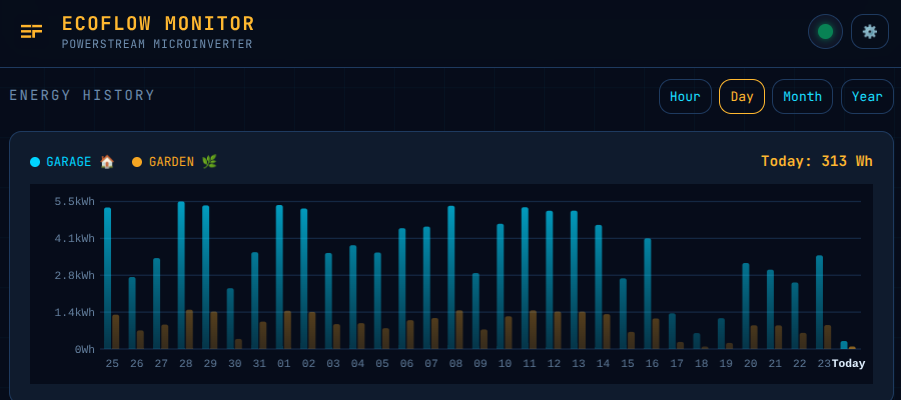
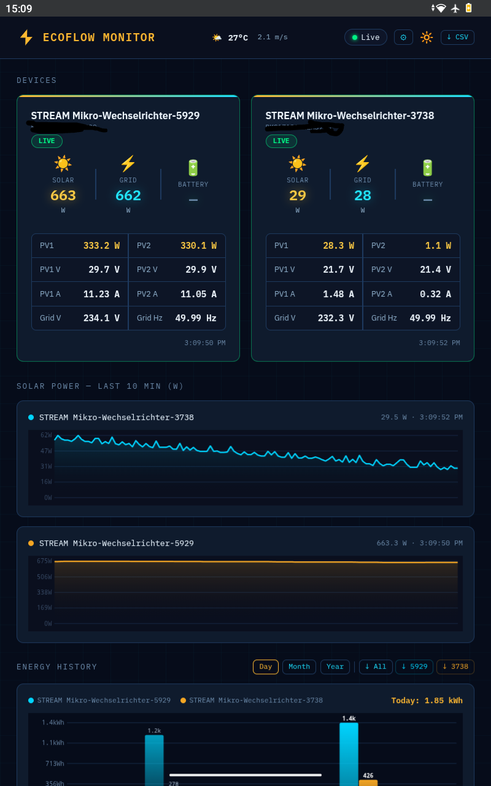
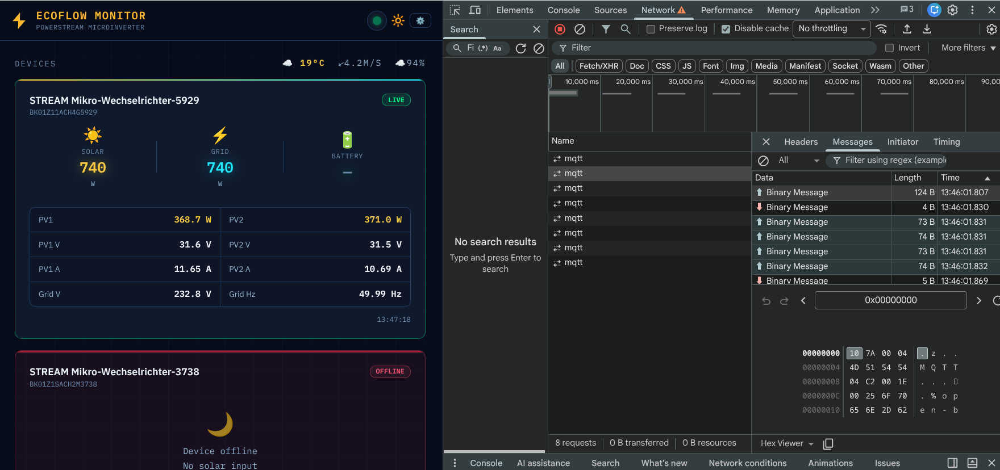
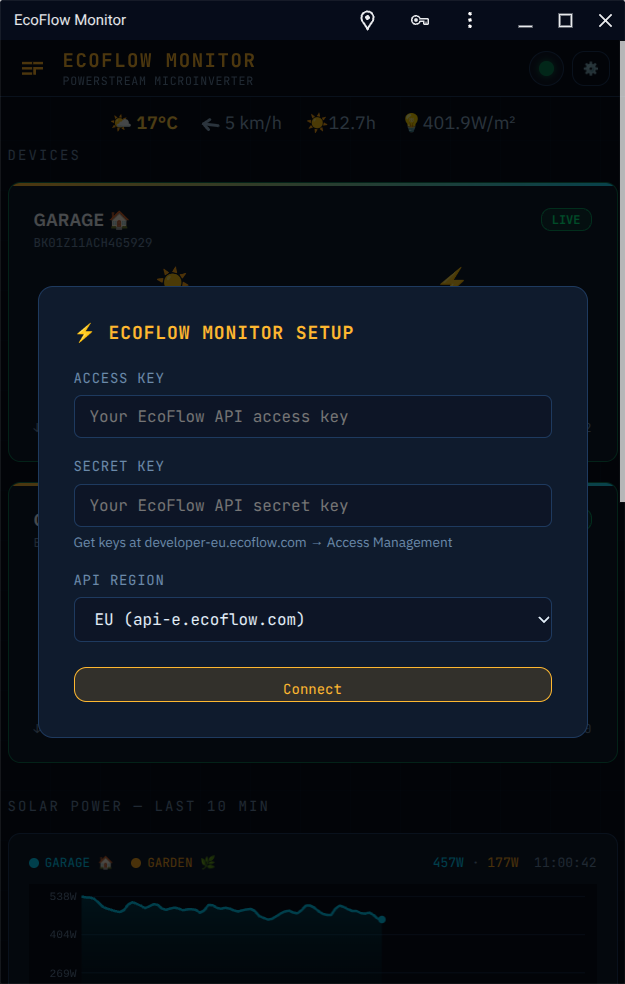
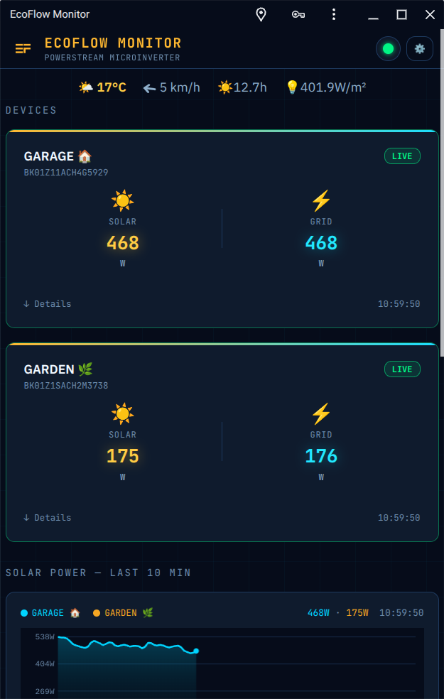
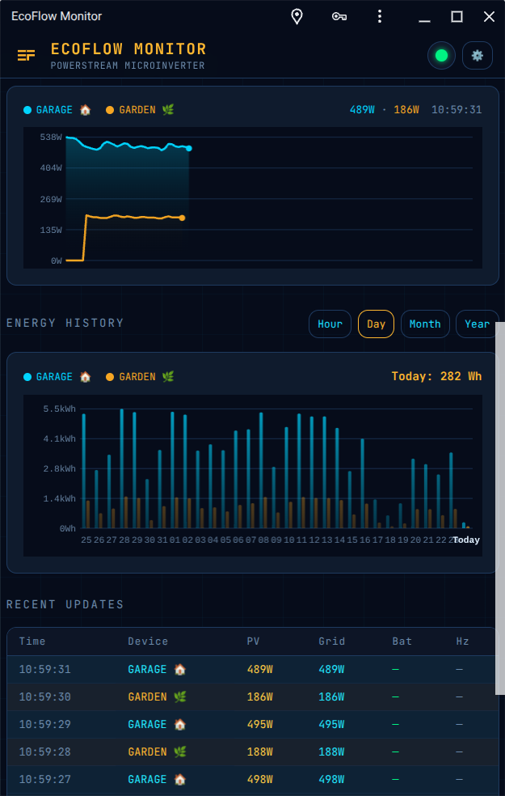
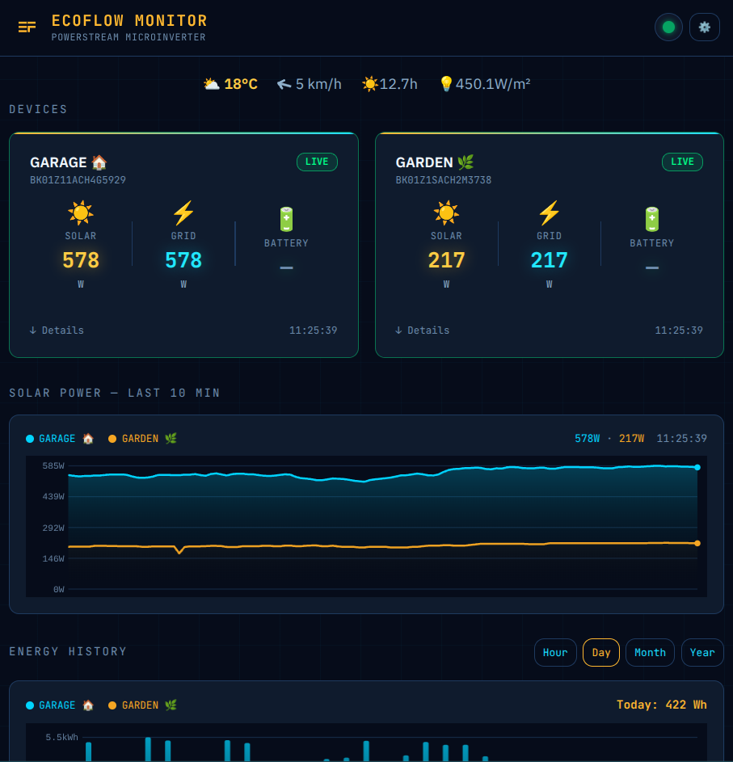
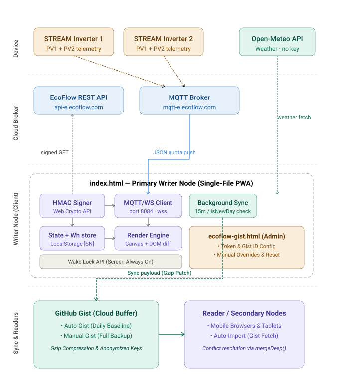
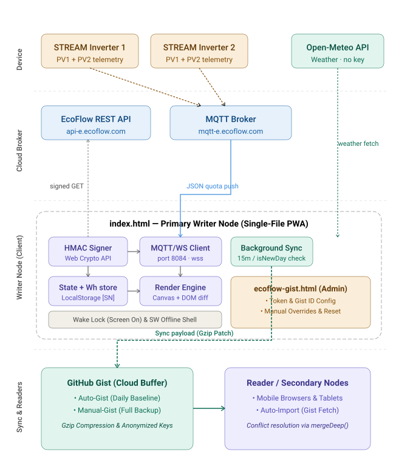

<div align="center">

# EcoFlow PowerStream Monitor PWA

<br><sub><b>Energy History</b> — Charts, CSV Export</sub>
<!--
-->

**A single-file Progressive Web App** for monitoring EcoFlow PowerStream MicroInverter devices (STREAM series) in real time.
No server required — runs entirely in your browser. (Requirements: EcoFlow Developer API)

[▶ Try with your keys directly live](https://danielw3b.github.io/ecoflow-powerstream-pwa/)


<table>
<tr>
<td align="center"><br><sub><b>Setup</b> — Accesskey+Secretkey</sub></td>
<td align="center"><br><sub><b>Real-Time</b> — tracking mqtt</sub></td>
<td align="center"><br><sub><b>Energy History</b> — charts, csv</sub></td>
</tr>
</table>
<br><br>
<br><sub><b>Tablet View</b> — More than Two inverter support</sub>
</div>

## Features

- **Real-time monitoring** — live solar power, grid feed-in, battery state via MQTT over WebSocket
- **More than Two inverter support** — side-by-side device cards with individual charts
- **Energy History** — Hour / Day / Month / Year bar charts with kWh accumulation
- **Weather widget** — current conditions via Open-Meteo (no API key needed)
- **CSV export** — per-device or combined, unit auto-scales by period
- **Offline detection** — instant via MQTT `/status` topic + API polling fallback
- **PWA installable** — add to home screen on Android/iOS, works as standalone app
- **Screen wake lock** — keeps display on while monitoring
- **Editable device names** — stored in localStorage
- **No server** — pure browser app, all data stays on your device
- **Dark theme** — high contrast, readable in direct sunlight
- **Dual-Gist Multi-Device Sync** — Anonymized background cloud sync via GitHub Gists (Auto-Gist for daily yield baselines & Manual-Gist for adjustment) with Gzip compression support.

## Requirements

- EcoFlow Developer API access key + secret key
  → Register at [developer-eu.ecoflow.com](https://developer-eu.ecoflow.com) (EU) or [developer.ecoflow.com](https://developer.ecoflow.com)
- EcoFlow PowerStream MicroInverter (STREAM series, 600W or 800W)
- Modern browser (Chrome 84+, Edge, Brave)

[▶ Try directly live](https://danielw3b.github.io/ecoflow-powerstream-pwa/)

## Quick Start

### Option A — Open directly (simplest)
1. Download `index.html`
2. Open it in Chrome on Android using a local HTTP server app (e.g. *HTTP Server* by paw.app)
3. Tap **⚙** → enter your Access Key and Secret Key → **Connect**
4. Install as PWA: browser menu → **Add to Home Screen**

### Option B — GitHub Pages (share with others)
1. Fork this repository
2. Settings → Pages → Source: main branch
3. Share `https://yourusername.github.io/ecoflow-pwa`
4. Each user enters their own API keys — nothing is stored server-side

### Option C — Local network access
Set `SERVER_URL` at the top of `index.html` to your server's IP if hosting via Node.js.

## Configuration

All settings are stored in `localStorage` — nothing leaves your device.

| Setting | Description |
|---|---|
| Access Key | EcoFlow developer API access key |
| Secret Key | EcoFlow developer API secret key |
| Region | EU (`api-e.ecoflow.com`) or Global (`api.ecoflow.com`) |

## Technical Details

### Architecture
```
EcoFlow STREAM Inverters
    ↓ MQTT (protobuf / JSON)
EcoFlow Cloud Broker (mqtt-e.ecoflow.com)
    ↓ MQTT over WebSocket (wss port 8084)
index.html (PWA Instance / Writer Node)
    ├── HMAC-SHA256 signing (Web Crypto API)
    ├── REST API calls & Canvas charts
    ├── LocalStorage (Wh history, device configs)
    └── Background Sync Engine (Dual-Gist)
            ├── Auto-Gist (Sunset-driven baseline patches & threshold checks)
            └── Manual Backup Gist (Manual sync, state overrides & adjustments)
                    ↓ HTTPS (GitHub Gist API + Gzip)
              GitHub Gist (Anonymized Cloud Buffer)
                    ↓ HTTPS Auto-Import
              Other Reader / Writer Devices (Tablets, Browsers)
```


<br><sub><b>1st PWA Architecture without Gist</sub>


<br><sub><b>2nd PWA Architecture with Gist</sub>

### API Used
- `GET /iot-open/sign/device/list` — fetch devices + online status
- `GET /iot-open/sign/certification` — get MQTT broker credentials
- MQTT topic `subscribe`: `/open/${certificateAccount}/${sn}/quota` — live telemetry (JSON)
- MQTT topic `subscribe`: `/open/${certificateAccount}/${sn}/status` — online/offline events
- **GitHub Gist API** (`PATCH /gists/{gist_id}`, `GET /gists/{gist_id}`) — automated background yield patches & state updates
- [Open-Meteo](https://open-meteo.com) — weather forecast and daily sunset times (no key required)

### Real Device Field Names
The STREAM inverter sends different field names than the official documentation:

| Field | Description | Unit |
|---|---|---|
| `powGetPv` | PV1 power | W (float) |
| `powGetPv2` | PV2 power | W (float) |
| `gridConnectionPower` | Grid feed-in power | W (float) |
| `gridConnectionVol` | Grid voltage | V |
| `gridConnectionFreq` | Grid frequency | Hz |
| `gridConnectionSta` | Grid connection status | string |
| `plugInInfoPvVol` | PV1 voltage | V (float) |
| `plugInInfoPv2Vol` | PV2 voltage | V (float) |
| `plugInInfoPvAmp` | PV1 current | A (float) |
| `plugInInfoPv2Amp` | PV2 current | A (float) |

### MQTT Notes
- Port **8084** (WebSocket/TLS) — not 8883 (raw TCP)
- Credentials from `/iot-open/sign/certification` — valid long-term
- Devices send **incremental updates** — fields arrive in small batches, state is merged
- Multiple browser tabs/devices can connect simultaneously

## Energy History

Wh values are accumulated locally using the trapezoid method:
- Readings ≤ 3 min apart → `Wh += avg_watts × hours`
- Gaps > 3 min → skipped (reconnects, night, etc.)
- Hour view: rolling 24 hours
- Day view: last 30 days
- Month/Year: aggregated from daily data
- Persisted in `localStorage` — survives page reloads and app restarts

## AI Assistant Reference

This project was built on may collaboratively with **Claude** (Anthropic) and later with **Gemini** over an extended conversation including:
- Reverse engineering the EcoFlow STREAM MQTT protocol and real device field names
- Debugging MQTT broker authentication (open API vs consumer API)
- Designing the single-file PWA architecture with no server dependency
- Iterative UI development based on real-world mobile testing

Claude's assistance was instrumental in navigating undocumented API behaviour and building a production-quality app from scratch. Model used: Claude Sonnet (claude.ai).
Since then also **Gemini**, Google’s primary conversational and agentic AI assistant was involved for future modifications and improvements.

Since then, **Gemini** (Google’s multimodal AI model) was extensively involved in expanding the project's capabilities, focusing on:
- Architecting the **Dual-Gist background synchronization engine** for multi-device harmony (Phone Writer vs. Tablet Reader nodes)
- Designing smart differential sync triggers (`isNewDay` daily resets, sunset-driven baselines, and `EXPORT_THRESHOLD_WH` throttling)
- Implementing local data anonymization (`ecoflow_analyzer_[4-digit-SN]`) and Gzip stream compression optimizations
- Refining multi-node deep merging logic (`mergeDeep()`) to prevent race conditions and payload loss across devices

## Development History & Milestones

1. **Performance & Energy Efficiency Optimization**
   Decoupled live telemetry processing from storage and rendering tasks. Introduced dedicated UI timers: `saveWh()` throttled to 30-second intervals to minimize LocalStorage I/O, and `renderChart()` running on a 10-second cycle. This significantly reduced CPU usage and battery consumption on mobile devices.

2. **Single-File PWA Foundation (`index.html`)**
   Iterative enhancement of the core PWA architecture, incorporating lightweight, highly optimized features such as standalone PWA support, Canvas-based rendering, and client-side HMAC Web Crypto API signing.

3. **Manual Syncing & Merging Utilities**
   Built initial multi-device support tools (`sync-tool.html` and `sync-merge.html`) for manual data exports and basic merging across devices without complex dependency overhead.

4. **Anomaly & Multi-Device Analyzer**
   Developed analytics tools to inspect daily yield anomalies and enable cross-device telemetry comparisons for multi-inverter setups.

5. **Automated Dual-Gist Cloud Sync & Deep Merge Engine**
   Evolved the ecosystem into an automated distributed network using GitHub Gist API. Introduced background cloud sync with Gzip compression, local key anonymization (`ecoflow_analyzer_[4-digit-SN]`), intelligent differential triggers (`isNewDay`, sunset baselines, dynamic Wh thresholds), and robust multi-node conflict resolution via `mergeDeep()`.

## License

MIT License — see `LICENSE` file.

## Contributing

Issues and pull requests welcome. Tested with:
- EcoFlow STREAM MicroInverter 600W / 800W (BK01Z series)
- Chrome on Android, Brave Browser
- EU region (api-e.ecoflow.com)

---
*Not affiliated with EcoFlow Technology Inc.*
